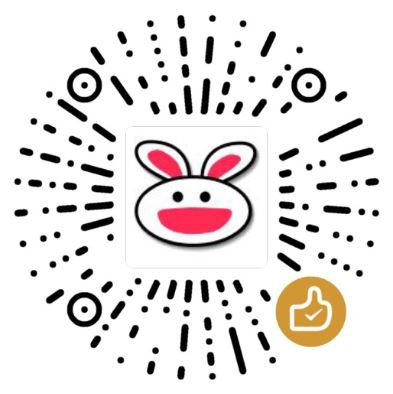

# MEmu模拟器运行火纹英雄及自动刷毛教程part2

如果没有观看自动刷毛教程part1的话，请先看part1吧。

## 1 动机

上贴提到能够在电脑上运行游戏后，会给我们带来一些方便，比如让游戏在一定限度内自动运行。

特别像是火纹英雄这个手游，其中有一些比较枯燥乏味的游戏模式，比如`RivalDomains(刷毛)`、`ForgingBonds`、`TempestTrials`等。

以前，我也使用过一些其他的点击器，有许多功能强大的，但是始终没有发现让我很满意的。我想要的最好是比较小巧，能够有较大的自由度的，于是我自己写了一款：`智能点击器`。

## 2 下载

这款点击器可以免费提供给您使用，

1.0版下载链接是： `https://wwa.lanzous.com/iZrLhjgf0ni (访问码:5mi1)`。

1.1版下载链接是： `https://wwa.lanzous.com/iLt1Yjv1f7i (访问码:7yg5)`。

## 3 食用方式

程序的配置目前是专门为`MEmu`模拟`英文版FEH`而设定的，当然也可以用于其他游戏，或者说许多程序不局限于`MEmu`。

如果您按照我说的配置好了英文版的FEH，然后想要刷毛，相信您不会失望的，因为我一直在用着呢。

启动`Intelligent Clicker`，软件启动完成后，在左下的下拉框选择游戏的模式，切换游戏到相应界面，点击`Start`按钮，就可以了。当需要停止时，按键盘上的`Ctrl+Alt+Q`组合键即可。

程序运行示范如下：





## 4 更进一步

如果你想要在别的地方使用我的`智能点击器`，请准备一些javascript学习资料。如果你看懂了`Config.ini`和那几个`.js`文件，也许我的点击器也可以在别处大展拳脚了。


我将看情况发布关于这款点击器的详细信息。如果你想要请我`喝杯咖啡`，我会非常感谢您！


